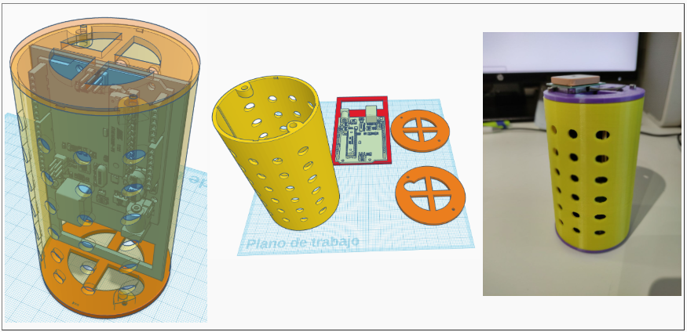
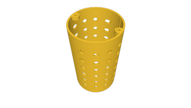
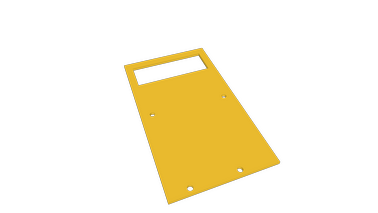

We offer three models that can be used as a basis for the final design of your CANSAT 3D structure.

## **3D structure by Pablo Moraga**
This 3D design of the CANSAT body has been designed at the Club Robótica Granada with the Tinkercad tool. The design is intended to leave as much space inside as possible, housing the ESP32 STEAMakers board with the corresponding sensors and peripherals.

It consists of the following elements:

|Part|Image|
|:-:|:-:|
|
<b>Body
</b> In addition, 4 M2.5 nuts are required for heat pressing and then screwing on covers ||
|
<b>Electronics tray
</b> To be inserted into the body through the longitudinal groove.  Also requires 3 M3x8 screws for fixing ESP32 ||
|
<b>Top cover
</b> Also requires 2 M2.5x10 screws for body mounting ||
|
<b>Bottom cover
</b> Also requires 2 M2.5x10 screws for body mounting ||

## **STL files**

* [cansat_body.stl](../STLs/CRG/cansat_body.stl)
* [cansat_plate.stl](../STLs/CRG/cansat_plate.stl)
* [cansat top_cover.stl](../STLs/CRG/cansat top_cover.stl)
* [cansat_bottom_cover.stl](../STLs/CRG/cansat_bottom_cover.stl)
