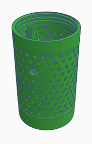
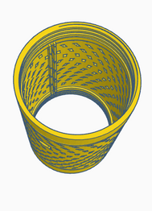
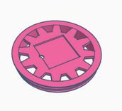
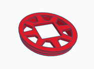
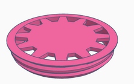

We offer three models that can be used as a basis for the final design of your CANSAT 3D structure.

## **3D structure by Pablo Moraga**
This CANSAT 3D case design was created by Pablo Moraga using the Tinkercad tool. It is a perforated body design with a hole for a power bank button, with threaded caps and a top cover with a GPS antenna housing. The top cover is also designed to house the parachute cords.

It consists of the following parts:

|Part|Image|
|:-:|:-:|
|
<b>Body
</b>||
|
<b>Top cover
</b> GPS (Standard and Keyestudio models) ||
|
<b>Bottom cover
</b>||

## **STL files**

* [CansatStructure.stl](../STLs/PM/CansatStructure.stl)
* [Cansat_GPS_cover.stl](../STLs/PM/Cansat_GPS_cover.stl)
* [Cansat_GPS_2.stl](../STLs/PM/Cansat_GPS_2.stl)
* [Cansat_Flat_Cover.stl](../STLs/PM/Cansat_Flat_Cover.stl)

