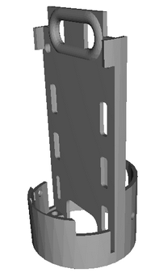
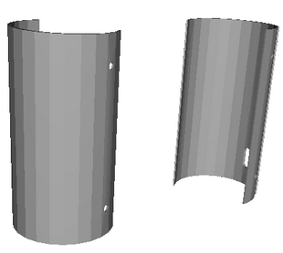
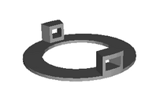
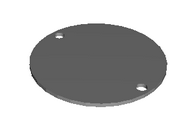

We offer three models that can be used as a basis for the final design of your CANSAT 3D structure.

## **3D structure by VegaSteam**
The 3D structure of the CANSAT (satellite) transmitter of the democratising Cansat proposal is based on a design by David Morales Arellano, a member of the VegaSteam team at the IES Federico García Lorca de Churriana de la Vega (Granada).

It has been designed for easy assembly and replacement of electronic components.

|Part|Image|
|:-:|:-:|
|
<b>Electronics Bay
</b> It is used to house the lora device and its associated electronics ||
|
<b>Airframe or external covers
</b> CANSAT perimeter enclosure ||
|
<b>Top and bottom caps
</b>|  |

## **STL files**

* [CRG_Bay.stl](../STLs/CRG_Bay.stl)
* [CRG_Airframe.stl](../STLs/CRG_Airframe.stl)
* [CRG_cap1.stl](../STLs/CRG_cap1.stl)
* [CRG_cap2.stl](../STLs/CRG_cap2.stl)

