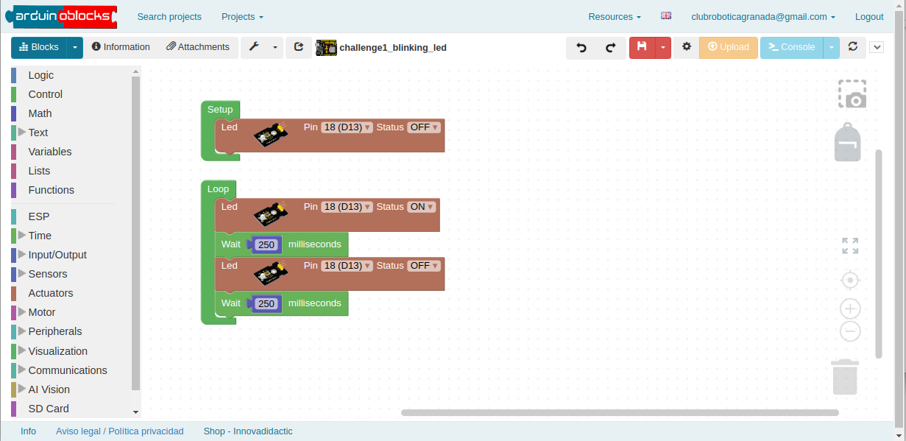

Any programmed control system needs an environment to execute the control program, in our case [Arduinoblocks](http://www.arduinoblocks.com/web/), a graphical programming environment that we will use to program the ESP32 STEAMakers. This environment has been developed by Juanjo López and is available online. You need to have a registered account on the Arduinoblocks website and the [Arduinoblocks Connector](https://www.arduinoblocks.com/web/site/abconnector5) program running on your computer to establish the connection between the online environment and the board.

## **Arduinoblocks task**
Install or locate the arduinoblocks connector software on your computer, and register an account on the arduinoblocks web service.

??? Question "Help (Spanish)"
    * [Arduinoblocks Connector](https://www.arduinoblocks.com/web/site/abconnector5)
    * [Full Arduinoblocks documentation](https://www.arduinoblocks.com/web/site/abconnector5)
    * [Arduinoblocks FreeBook](https://www.arduinoblocks.com/web/site/abconnector5)
    * [Arduinoblocks youtube channel](https://www.youtube.com/@arduinoblocks/videos)
