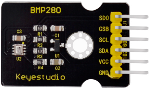
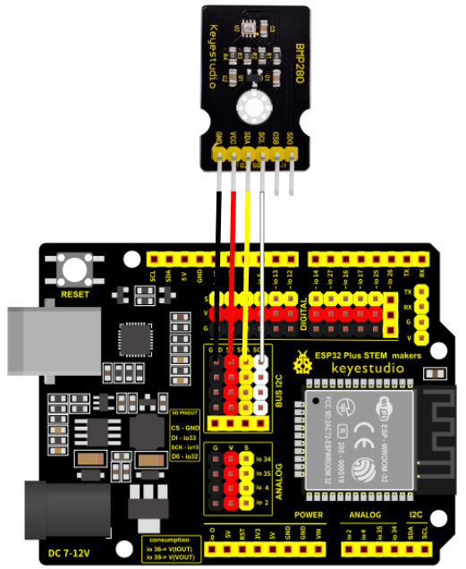
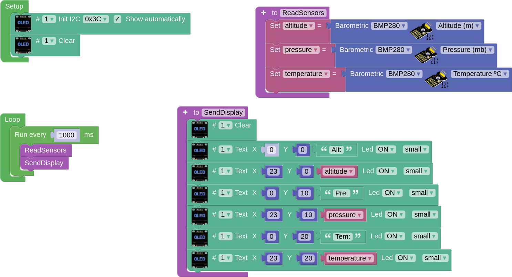

## **BMP280 Sensor**
This sensor gives us barometric pressure, altitude (thanks to the pressure) and temperature. It is connected through the I2C bus port, in our case we will connect it to one of the 4 I2C plugs on the board. To know more about this sensor we can see its description in the [Keyestudio wiki](https://wiki.keyestudio.com/KS0405_Keyestudio_BMP280_Module_(Black_and_Eco-friendly)).

## **Wiring**
In our case, just connect the GND, VIN, SDA and SCL pins to their corresponding pins on any of the male I2C ports (4) on the board.

## **Task. To measure pressure, altitude and temperature**
It correctly connects the LED display to the BMP280 sensor and displays the pressure (millibars), altitude (metres) and temperature (°C) values every second in a clear and orderly manner on the display.

??? Question "Help"
    [Code](../programs/cansat_bmp280_test.abp)
    
    
