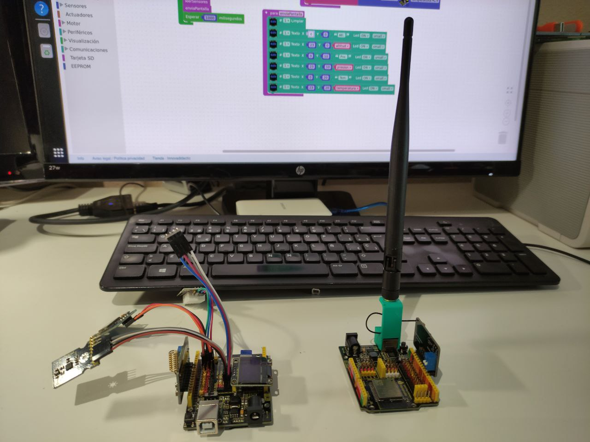
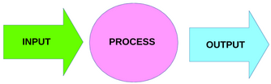
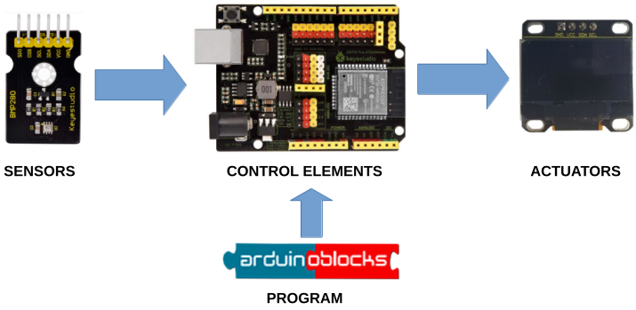
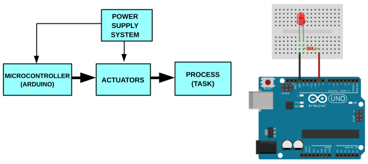
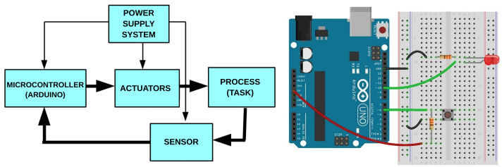

## **Definition**
An automatic control system or automatism is a set of technical elements that together are capable of performing a series of actions to solve a problem without human intervention.

The ones we are going to use in our course are programmed, which means that the automatism will work depending on a programme that we will tailor to the function to be carried out.

In our case, we are going to create a sensor data transmitter, which will be our satellite, and a data receiver and plotter located on the ground.

## **Elements**
Our control system will basically contain three blocks of devices:

{align=right}

* <u>Process or control elements</u>: these are the ones that are going to be programmed, they will receive data from the input elements to decide what to do with the output elements. In our case it is ESP32 STEAMakers.

 

* <u>Input elements</u>: they will be sensors that can be connected to our control system, they can be: pushbuttons, switches, limit switches, ntc, ldr, accelerometers, gyroscopes, barometers, gps, etc.
* Output elements: these will be the actuators, which our programme will decide to start and stop, such as: LEDs, buzzers, motors, screens, etc.

## **Types**

**Open Loop**

There is no feedback, which means that the controller gives a start command to the actuators without the signal from the sensors (input elements) being monitored at any time.

**Closed Loop**

There is feedback, which means that the control system is always monitoring the sensors (input elements) to perform one action or another depending on the state of the sensors.

