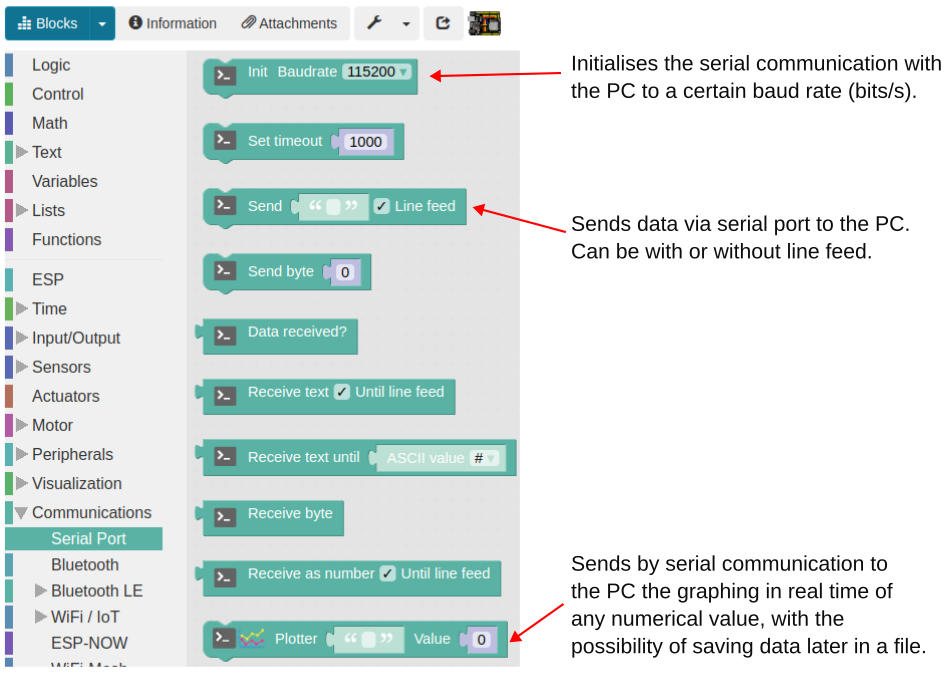
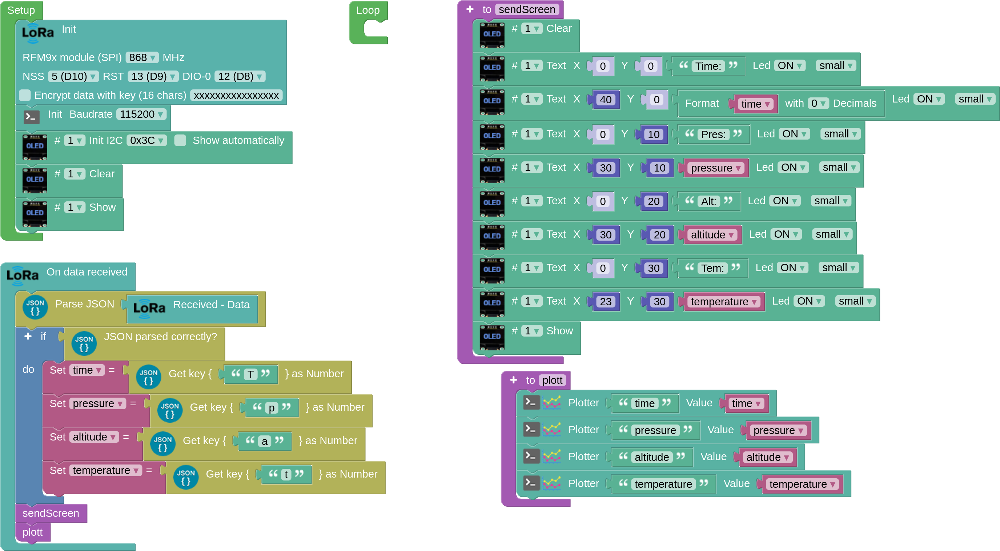

To process the data received from the receiver on the computer, we have previously sent the data (sender program) in JSON format via LoRa communication. To process it on the computer, we need to collect it on the board or receive it via LoRa in JSON format, analyse it and extract it by assigning it to variables that will be sent to the computer via the serial port (USB serial communication), plotted in real time and then saved in CSV format.

The programme we need to do this adds serial communication and graphing to the previous JSON reception programme. The following figure shows the most common serial communication tools used in Arduinoblocks.

[Program for receiving data in JSON format and graphing:](../programs/cansat_receiver_bmp280_json_plott.abp)

In this programme we use a function called 'plott', which uses the 'Plotter' block, which is used to plot data from serial communication between data on the board that is sent to the computer.

The following video documents real-time graphing and CSV data extraction:

[https://youtu.be/2hBiAoo6d0M](https://youtu.be/2hBiAoo6d0M)

