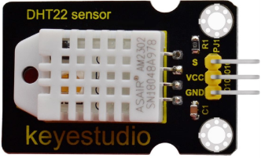
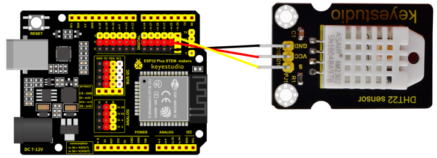
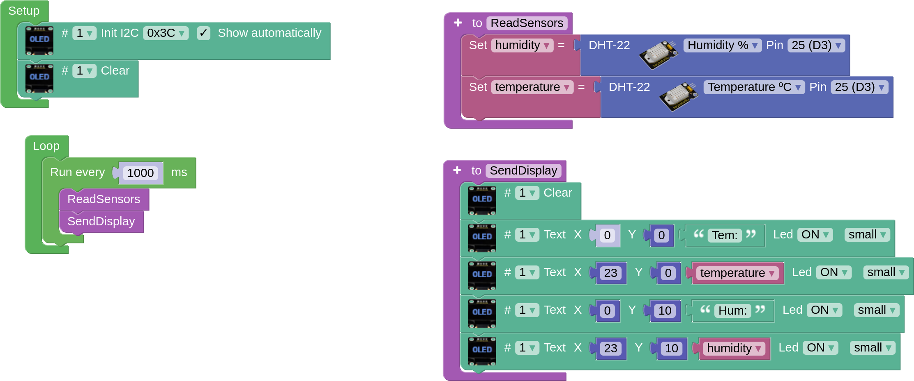

## **DHT22 Sensor**
The DHT22 digital sensor can provide temperature and humidity. It is connected to a digital pin, in our case we have chosen D3 (IO25) of our board. To know more about this sensor we can see its description in the [Keyestudio wiki](https://wiki.keyestudio.com/KS0430_Keyestudio_DHT22_Temperature_and_Humidity_Sensor).

## **Wiring**
The DHT22 sensor is connected to a digital pin, in our case we have chosen D3 (IO25) on our board. We connect the S of the sensor to the S of pin D3 (IO25) of the board, the + of the sensor to the V of the board and the - of the sensor to the G of the board.

## **Task. Temperature and humidity measurement**
It correctly connects the LED display to the DHT22 sensor and displays the temperature and humidity values every second in a legible and orderly manner.

??? Question "Help"
    [Code](../programs/cansat_dht22_test.abp)
    
    
