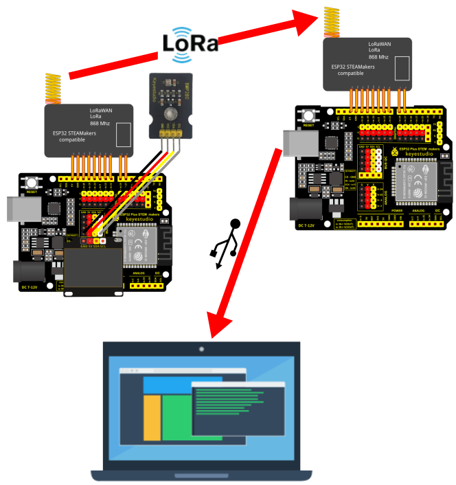

## **Challenge solved: first communication with LoRa**
This is a transmitter consisting of an ESP32 STEAMakers with LoRa module, an oled screen and a BMP280 sensor. It must collect time, pressure, altitude and temperature data, display it on the transmitter screen and transmit it to the receiver, which consists of ESP32 STEAMakers with LoRa module. The frequency of these operations is every second.

The receiver is connected to the PC via USB using serial communication, and the data received is displayed and plotted on the PC in real time.

