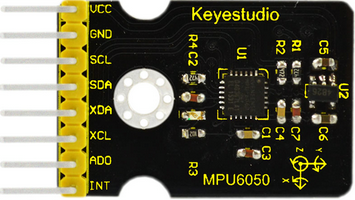
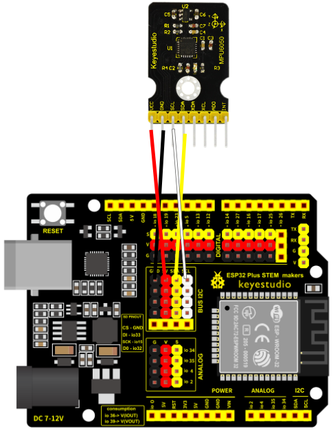
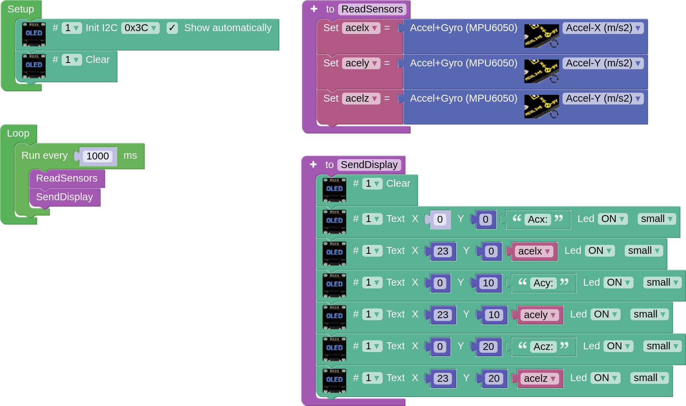

## **MPU6050 Sensor**
The MPU6050 sensor is an accelerometer and gyroscope that can provide acceleration and tilt in the three axes of space. It is connected via an I2C bus port to one of the 4 ports with male pins on the board. To know more about this sensor we can see its description in the [Keyestudio wiki](https://wiki.keyestudio.com/Ks0170_keyestudio_MPU6050_Gyroscope_and_Accelerometer_module).

## **Wiring**
In our case, simply connect the GND, VCC, SDA and SCL pins to the corresponding pins on one of the male I2C connectors (4) on the board.

## **Task. Measurement of accelerations**
It correctly connects the OLED display to the MPU6050 sensor and displays the acceleration values in all three axes every second in a readable and orderly manner on the display.

??? Question "Help"
    [Code](../programs/cansat_mpu6050_test.abp)
    
    
