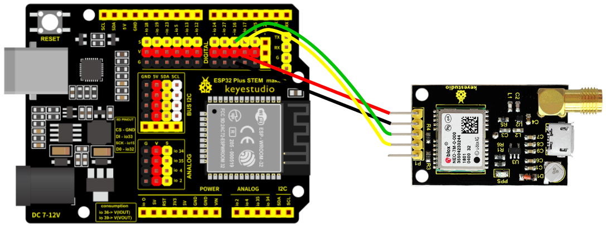

## **GPS**
The GPS (Global Positioning System) is a device that allows us to determine our position on planet Earth by communicating with satellites. Specifically, we have the GPS6MV2 model, based on the UBLOX NEO 6M receiver chip. It communicates with the board via a serial port. To know more about this sensor we can see its description in the [Keyestudio wiki](https://wiki.keyestudio.com/KS0319_keyestudio_GPS_Module).

## **Wiring**
The GPS is connected to a serial port on our board, specifically the ESP32 STEAMakers has two serial ports, 1 (pin RX D0, pin TX D1) and 2 (pin RX2 D5, pin TX2 D4). Specifically, we will connect to serial port 2, as port 1 is used for communication with the computer, and for example to load programs from the computer to the board. We will connect the RX pin of the GPS to the TX2 pin (D4 IO17) of the board, and the TX pin of the GPS to the RX2 pin (D5 IO16) of the board. The Vcc (+) of the GPS is connected to the + of the board (V) and the GND (-) of the GPS is connected to the - of the board (G).

## **Task. GPS positioning**
It correctly connects the OLED screen to the GPS and displays the values of latitude, longitude and altitude on the screen every second in a legible and ordered manner. Latitude and longitude with 6 decimal places and altitude with 2 decimal places. By default, the numerical variables, when displayed directly on the screen, offer only two decimal places.

??? Question "Help"
    [Code](../programs/cansat_gps_test.abp)
    
    
