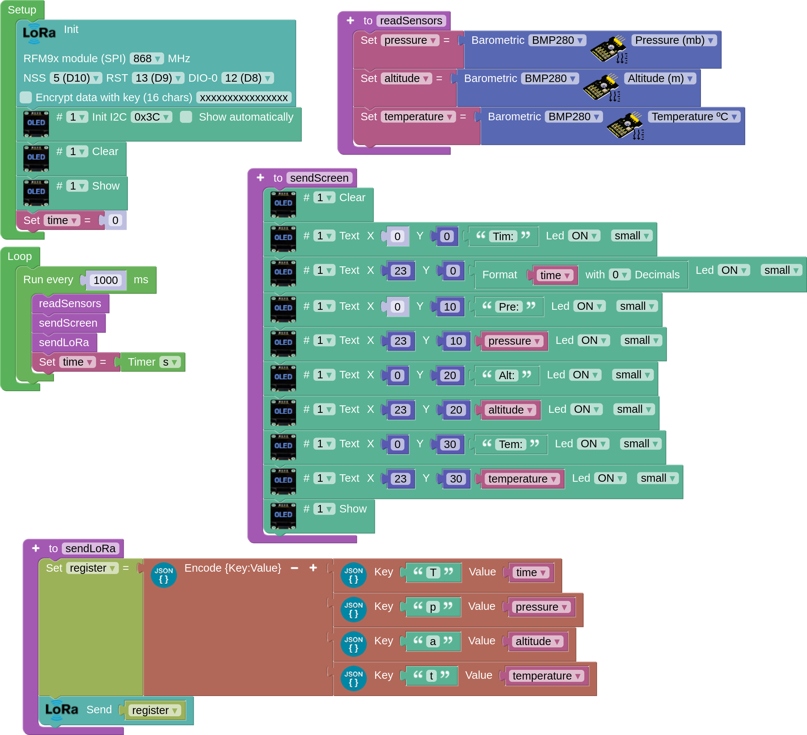
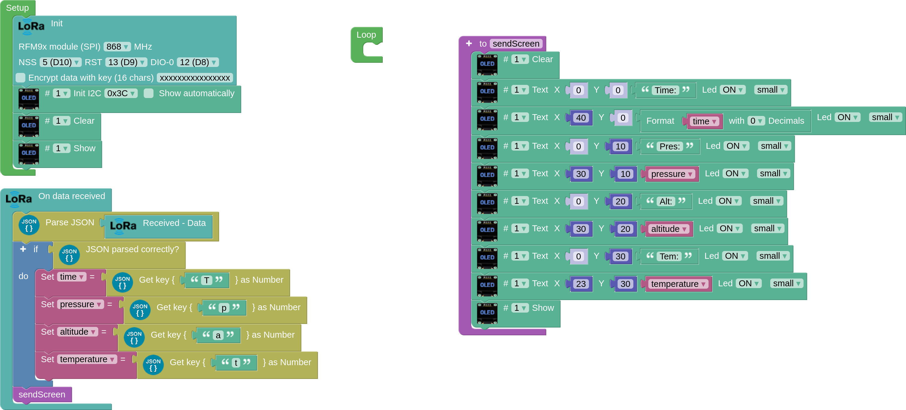

## **JSON format**
JSON (JavaScript Object Notation) is a structured format for storing and exchanging information, mostly used in client server communications.

There are two fundamental elements in a JSON object: Keys and Values.

* Keys must be strings. They contain a sequence of characters, they start and end with quotes, they are the header or identification of the data I want to record.
* Values are a valid JSON data type. It can be in the form of array, object, string, boolean, number or null. They are separated from their Keys pair by a colon (:).

A JSON object begins and ends with braces {}, and consists of key/value pairs, separated by a comma. In addition, each key is followed by a colon that separates it from the value.

The syntax of a JSON object if the values are numeric would be:

{“key”:value, “key”:value, “key”:value}

In the case of our example below what we do is to send and receive the numeric values of pressure, altitude and temperature from sender to receiver, in JSON format.

Each data frame could look something like the following example:

{“pressure”:948.05,“altitude”:550.55,“temperature”:22.99}

## **LoRa JSON Emitter**
This program sends the time (s), pressure (mb), altitude (m) and temperature (ºC) information to a LoRa receiver every second via LoRa in JSON text format.

[Code](../programs/cansat_emitter_bmp280_json.abp)

## **LoRa JSON Receiver**
We will connect an OLED screen to the receiver, because with the JSON format we can easily extract and separate the information to display on the screen.

The following program receives the data via LoRa from the previous sender, parses the JSON data and, if it is correct, assigns it to variables and displays it on the OLED screen.

[Code](../programs/cansat_receiver_bmp280_json.abp)

## **For more information**
[Basic parsing of JSON data on arduinoblocks](https://drive.google.com/file/d/1r290vEJVVZtt8yp4PELnxgTEFWqUUBZk/view), by Juanjo López. (Spanish content).
