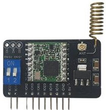
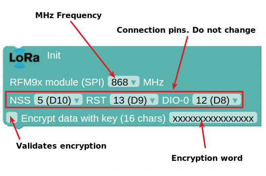
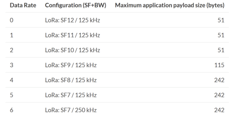
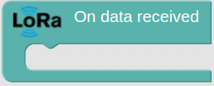
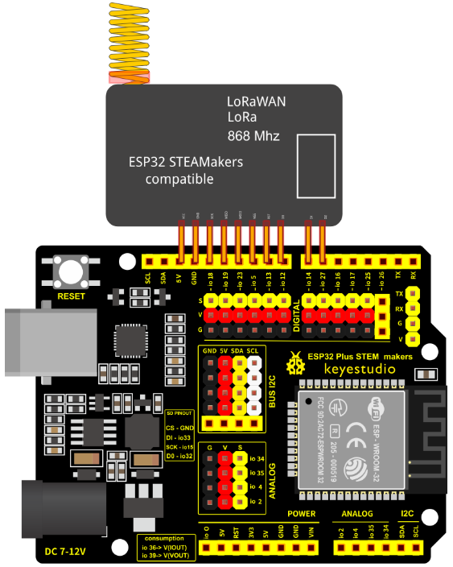
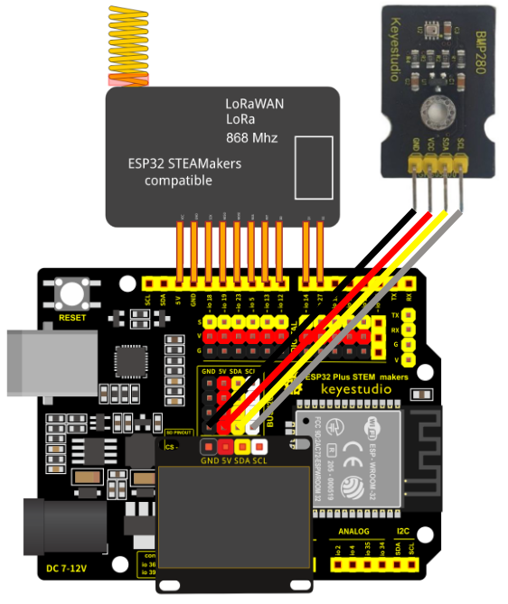
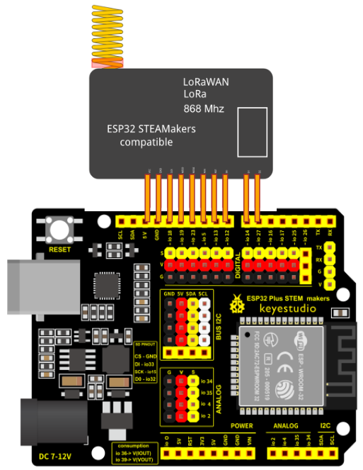

## **Lora - LoRaWan module. LoRa Communications**
LoRa modules can send and receive LoRa (LongRange) signals. LoRa is a patented communications technology designed to provide low power, long range and good interference immunity, making it ideal for IoT applications.

## **LoRa commands on arduinoblocks**
$\triangleright$ To initialise the LoRa device in Arduino blocks, we need to use the following block in the 'Initialise' structure of our program. In this block we can configure two parameters:

:    * Frequency (MHz): the operating frequencies vary from country to country and are usually the 433MHz, 868MHz and 915MHz bands. In our case, 868 MHz.
:    * Encryption word of 16 characters: it can be used or not, it is used to protect our data sent through an encryption process. In order for communication to take place between the transmitter and receiver, they must have the same encryption word.
:    * With regard to the configuration of the connection pins, you do not need to touch the standard ones if you connect them as indicated in the following section (direct connection to the female pins on the board).

$\triangleright$ Sends a data frame. The maximum length of data to be sent varies between 51 and 242 bytes (characters). It depends on the frequency used (868 MHz in our case), the bandwidth used (125000 Hz by default) and the SF (Spreading Factor) used (7 by default). Therefore, by default, it can send a maximum of 242 bytes (characters).

$\triangleright$ Event triggered when data is received via LoRa.

$\triangleright$ Within the previous event, it returns the character frame that was sent to us. If we assign it to a variable, it must be a text variable.

$\triangleright$ Within the above event, it returns the received signal strength. If we assign the value to a variable, it must be numeric.

## **Wiring**
The LoRa module is connected directly to the ESP32 STEAMakers board between the top 5V pin and digital pin 6 (D6 / IO27). The 5V socket on the board must be matched to the VCC pin of the LoRa module, as shown in the schematic. The connection of this module is SPI type (it uses the SPI port on the board).

## **Task. Connection for first LoRa communication**
Connect the LED display, the BMP280 sensor and the LoRa module to the transmitter board correctly. Connect the LoRa module to the receiver board correctly. This wiring will be useful for the next exercise of communication between the boards.

??? Question "Help"
    **Transmitter wiring:**

    

    **Receiver wiring:**

    
    
## **For more information**
[LoRa y LoRaWAN en Arduinoblocks + ESP32 STEAMakers](https://drive.google.com/file/d/1tZecaEcz6yPZwbVpgCbpPG4LeU5A3kPs/view), by Juanjo López. (Spanish content)
