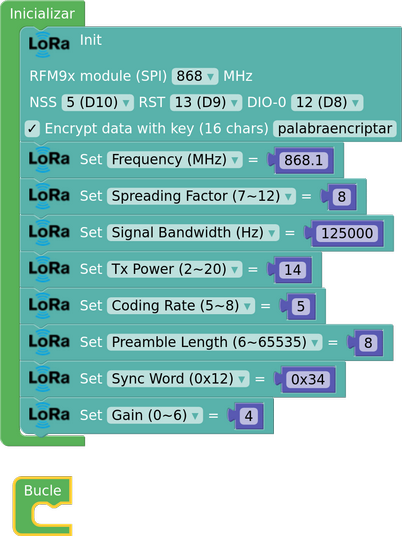
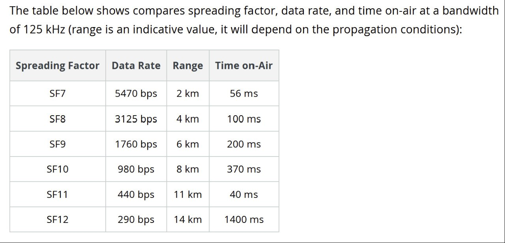

## **LoRa. Signal type**
LoRa is a patented communication technology designed to provide low power, long range and good immunity to interference, making it ideal for IoT applications.
The LoRa communication system is based on CSS (Chirp Spread Spectrum) modulation, a wideband modulation technique that uses chirps to encode information. The chirps are like one-tone beeps whose frequency increases or decreases linearly with time over the used bandwidth (BW), symmetrically to the centre frequency, and each chirp represents a symbol that can have 2F values, where F is the Spread Factor.
In the LoRa system, data packets are transmitted and these data packets consist of

* A preamble consisting of a number of variable chirps and a sync word. On reception, the received preamble is checked to see if it matches the programmed preamble, and if it does not, the rest of the message is discarded.
* Header, which can be explicit or implicit and, in the case of an explicit header, contains information on the number of data to be sent, the error coding rate and the presence of an error check code.
* Payload, which is the net information to be transmitted. In Lora the maximum number is 255 bytes (characters).

## **LoRa P2P transmission parameters**

**Initialisation of the LoRa module**

When we initialise the LoRa module with the initialisation block, for a given central frequency (in our case 868 MHz), it sets a series of default parameters, which are as follows:

{align=right}

* Frequency = 868 MHz
* TxPower =17
* SpreadingFactor= 7
* Bandwith= 125000 Hz
* CodingRate= 5
* PreambleLength= 8
* SyncWord= 0x12
* Gain = 0 (auto)
* EnableCRC= disable

       

In the program we can modify any of these parameters with the following arduinoblocks related to the modification of our LoRa transmission:

**TX Power**

Defines the decibel (dB) transmission power of our LoRa device. We can give values between 2 and 20 decibels (dB), default 17 dB.

**Frequency. Frequency (Carrier)**

Defines the carrier frequency of the medium used for both transmission and reception. It also depends on the operating region: in Europe, the LoRa operating carrier frequency is the EU ISM band 863-870MHz. In our case it is 868 MHz by default. We can change to non-integer values, as shown in the configuration example in the picture.

**BandWidth**

It represents the width of LoRa radio frequency signals, it is actually a frequency range that oscillates with respect to the base frequency where the highest signal power is concentrated, which is used for data transmission. It is usually set at 125 kHz, but can be increased up to 250 kHz or even 500 kHz in some regions for particular modulation parameters.

A higher bandwidth provides a higher data rate (hence shorter time on air), but a lower sensitivity (due to additional noise integration).

A lower bandwidth provides a higher sensitivity, but a lower data rate.

The default bandwidth is 125 KHz, but can be given the following range of values: 7.8 KHz, 10.4 KHz, 15.6 KHz, 20.8 KHz, 31.25 KHz, 41.7 KHz, 62.5 KHz, 125 KHz, 250 KHz, and 500 KHz.

**Spreading Factor (SF) or Spread Factor**

This is the chirp spread parameter* which determines how many chirps are sent per second. It has a default value of 7, but can be set to any value between 6 and 12. In detail, a high SF increases the symbol airtime (data to be transmitted) and the power consumption, thus improving the communication range but reducing the available data rate and the size of the message payload.

Each increase in the Spread Factor (SF) halves the data rate and therefore doubles the transmission time and ultimately the power consumption.

The lower the SF, the higher the data rate and the shorter the range; the higher the SF, the lower the data rate and the longer the range. The range is also highly dependent on the environment and any structures or obstacles in the way.

*(Chirp): are frequency pulses (ascending or descending) whose sequence is used to send symbols (data).

**Coding Rate**

This is the Forward Error Correction (FEC) ratio used by LoRa. FEC is the process where error correction bits are added to the transmitted data. The Code Ratio refers to the ratio of transmitted bits that actually carry information to the total. LoRa allows the following values: $CR = \left\{\frac{4}{5},\frac{4}{6},\frac{4}{7},\frac{4}{8}\right\}$ which are calculated as follows: $CR = \frac{4}{4+CR}$ where $CR = \left\{1,2,3,4\right\}$.

It takes a default value of 5, but can be given a range of values between 5 and 8.

**Preamble Length**

They are a number of symbols sent at the beginning of each LoRa data transmission, their default value is 8, but they can be given a range between 6 and 65535 symbols.

**Sync word**

Sets the sync word of the LoRa radio communication. It is a hexadecimal byte whose default value is 0x12, and can take a range of values between 0 and 0xFF.

**Gain**

Sets the LNA gain for best RX sensitivity; by default, AGC (automatic gain control) is used and LNA gain is not used.
Values from 0 (automatic gain) to 6. Default 0.

**CRC**

Cyclic Redundancy Check (CRC) is an error detection code often used in digital networks and storage devices to detect accidental changes to data. It checks arithmetically that the data received matches the data sent. CRC is by default disabled and can be enabled or disabled.

## **Efficient communication between LoRa devices**
In order to establish a point-to-point communication between two LoRa devices, all these requirements must be met:

* That they work with the same values simultaneously of:

    * Frequency.
    * Bandwidth.
    * Coding Rate.
    * Spreading Factor.
    * Preamble Length.
    * Sync Word.
    * CRC have it the same (on or off).
    * If the information is encrypted, same encryption word.

