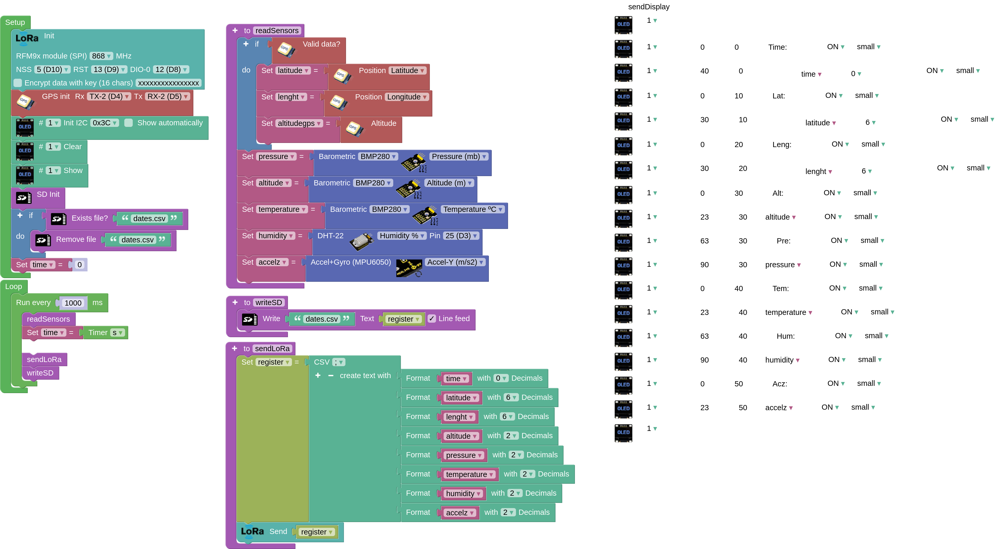

## **Final task wiring**
Mount the transmitter, which consists of an ESP32 STEAMaker with LoRa module, OLED display, BMP280 sensor, MPU6050 sensor, DHT22 sensor and GPS, and the receiver, which consists of an ESP32 STEAMaker with LoRa module.

??? Question "Help"
    **Emitter scheme:**
    
    In the transmitter, we can dispense with the display if we wish, as it will only be of use in testing and not in a real launch.
    
    
    
    **Receiver scheme:**

    

## **Final task programmes with data in JSON format (recommended)**
We have a transmitter consisting of an ESP32 STEAMakers with LoRa module, LED display, BMP280 sensor, MPU6050 sensor, DHT22 sensor and GPS. It should collect and send the following data every second: elapsed time, latitude, longitude, altitude (bmp280), pressure, temperature (bmp280), humidity and z-axis acceleration. The receiver, consisting of ESP32 STEAMakers with LoRa module and 0.96' OLED screen, is connected to the PC via USB and performs a serial communication, displaying and plotting in real time on the PC the data received from the Arduino blocks. Both the transmitter and the receiver store the data in CSV format on microSD.

In this case, the data sent and received are encoded in JSON format, so that we can easily extract and separate the information on reception to display it on the screen.

??? Question "Help"
    [Emitter](../programs/cansat_emitter_json.abp) code:

    In the transmitter we can dispense with the screen if we wish, and we can therefore deactivate the 'sendScreen' function, as it is only useful for testing and not for a real start.

    

    [Receiver](../programs/cansat_receiver_json.abp) code:

    

## **Final task programmes with data in CSV format**
We have a transmitter consisting of an ESP32 STEAMakers with LoRa module, LED display, BMP280 sensor, MPU6050 sensor, DHT22 sensor and GPS. It should collect and send the following data every second: elapsed time, latitude, longitude, altitude (bmp280), pressure, temperature (bmp280), humidity and z-axis acceleration. The receiver consists of ESP32 STEAMakers with LoRa module and is connected to the PC via USB, performing serial communication and displaying and plotting the received data on the PC in real time. Both the transmitter and the receiver store the data in CSV format on microSD.

In this case, the transmit and receive data are encoded in CSV format.

??? Question "Help"
    [Emitter](../programs/cansat_emitter.abp) code:

    In the transmitter we can dispense with the screen if we wish, and we can therefore deactivate the 'sendScreen' function, as it is only useful for testing and not for a real start.

    

    [Receiver](../programs/cansat_receiver.abp) code:

    
