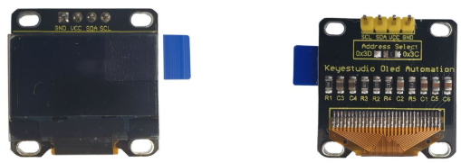
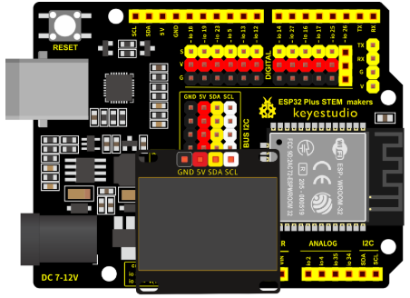
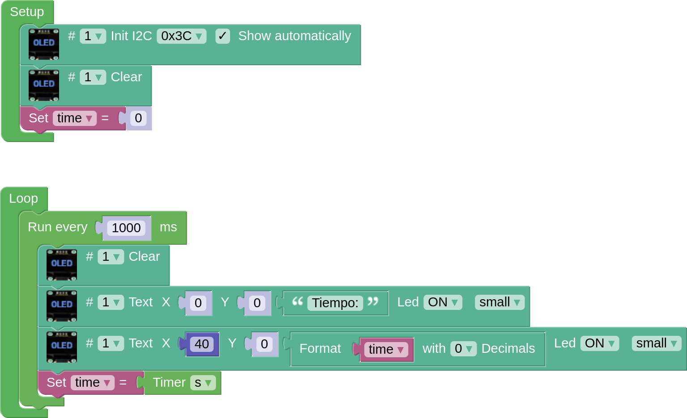

## **OLED display**
The OLED screen we are using has a diagonal of 0.96’ and a pixel resolution of 128x64. It uses the I2C serial bus connections, which on the ESP32 STEAMakers board have 5 I2C connections, 4 male and 1 female, the latter is where we connect the OLED screen. To know more about this sensor we can see its description in the [Keyestudio wiki](https://wiki.keyestudio.com/Ks0271_keyestudio_OLED_Display_OLED_Module).

## **Wiring**
The pins of the oled display are connected directly to the female I2C port of the board.

## **OLED Task**
Connect the OLED display correctly to the control board and display the time that has elapsed since the system was switched on. Do this at one-second intervals.

??? Question "Help"
    [Code](../programs/cansat_oled_test.abp)
    
    
