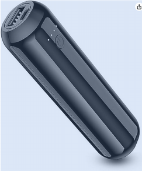
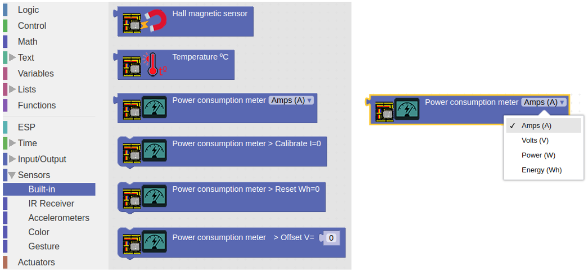
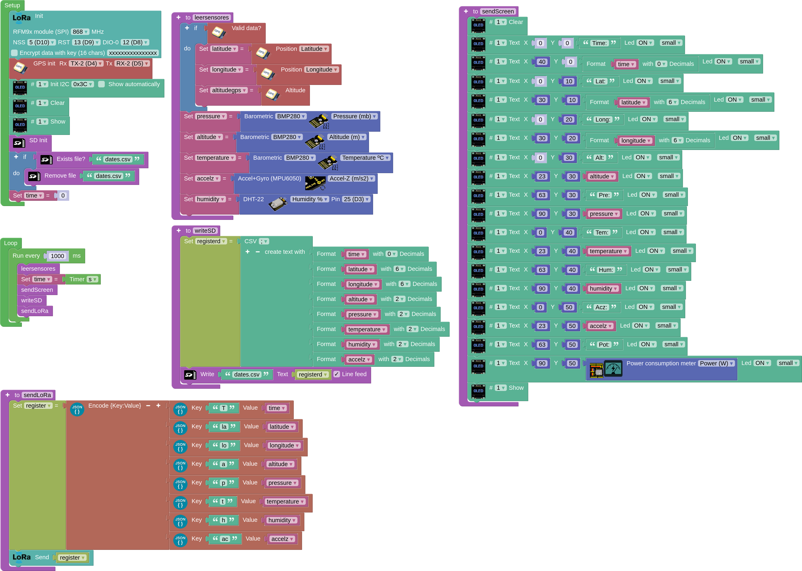

## **Power**
To power our CANSAT transmitter we will use a power bank which will supply power to our CANSAT transmitter via the USB B port (printer type) of our ESP32 STEAMakers. In order to meet the requirement of switching our CANSAT transmitter on and off from an external button or switch, it is recommended to use a power bank with a switch on/off.

## **Integrated sensors. Energy Sensor**
The ESP32 STEAMakers board has built-in sensors, including energy sensors. This special sensor can measure current (A), voltage (V), power (W) and energy (Wh) through Arduino blocks.

## **Battery life calculation**
We must first measure the power requirement of the CANSAT transmitter and then calculate the duration of the power supply or battery. Like $Power = \frac{Energy}{Time}$, knowing the energy that the battery can store and the power required by the CANSAT transmitter, we can know the battery life.

$Time = \frac{Energy}{Power}$

Units of energy stored in a battery:

* 1 watt hour (w.h.): if a 1 watt device is connected to the battery, it can power it for 1 hour. This is the device to use.
* 1 milliAmpere.hour (mA.h): it is convenient to convert it to W.h, for this we need to know the voltage of the battery, to calculate the electrical power ($Power = Voltage \cdot Intensity$), to later calculate the energy ($Energy = Power \cdot Time$), expressing the energy in W.h. For example, a battery with a voltage of 3.78V and 11300mA.h has an energy of $E = V \cdot I \cdot t = 3.78V \cdot 11.3A \cdot 1h = 42.71 W \cdot h$. Then a device of 1W power could be connected 42.71 horas $Time = \frac{Energy}{Power} = \frac{42.71 W \cdot h}{1 W} = 42.71 h$

## **Power measurement and battery life calculation**
Add the necessary code to display the power (on screen or serial port) in your CANSAT programme.Remember that all the elements must be connected and working.If you have a GPS, it must work and give us the position.

Once the power is obtained, calculate the time in hours that the system can work, knowing the capacity of your battery in mA.h and its operating voltage.

??? Question "My case resolution"
    In my case, with the attached code, the OLED screen shows me the power in W, giving me a value of 1W. As my battery has a capacity of 2500 mA.h at 3.7V, its energy is:

    $Energy = Power \cdot time = Voltage \cdot Intensity \cdot time$

    $Energy = 3.7V \cdot 2.5 A \cdot h = 9.25 W \cdot h$

    To calculate the life of the battery:

    $Time = \frac{Energy}{Power} = \frac{9.25 W \cdot h}{1 W} = 9.25 h$

    [Code](../programs/cansat_json_emitter_power.abp):

    
