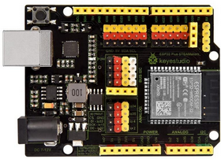
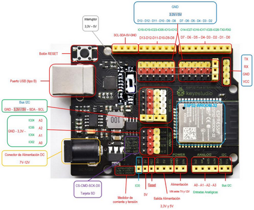
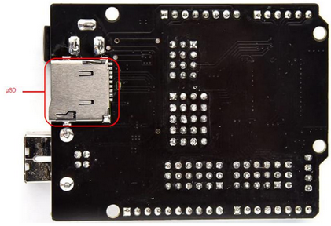

In our case we will use an ESP32 Steamakers programmable microcontroller board as the control element for several reasons:

{align=right}

* ESP32 based which means, processing power, wifi and bluetooth connectivity, etc.
* Arduino form factor and compatibility with Arduino shields.
* Easy connection. Male pinout available for the board ports, so connection can be done without breadboard.
* Built-in sensors: power, temperature and magnetic field.
* Built-in microSD card reader.
* Arduinoblocks is fully compatible with it, designed for all its functionalities.
* Detailed technical documentation.
* Extensive didactic documentation.
* Quality construction and manufacturer support.
* Designed in Spain by teachers for teaching purposes.
* Several distributors in Spain.

## **Technical specifications and pinout**
The most important features of this board are:

{align=right}

* Tensilica Xtensa 32-bit LX6 160MHz microcontroller.
* Wifi 802.11 b/g/n/e/i connectivity.
* Bluetooth 4.2 connectivity and BLE mode.
* µSD card socket.
* 14 powered digital inputs and outputs.
* Powered female serial connector.
* I2C connector to connect up to 5 devices at the same time on the same board.
* I2C female connector for connection of an OLED display.
* Reset button.
* 5V connector.
* 3.3V connector.

{align=right}

* Selectable 3.3-5V switch to switch between these two voltages on some power supply pins.
* Analogue inputs and outputs.
* Integrated Hall and temperature sensor.
* Two 8-bit Digital-to-Analog converters (DACs).
* Sixteen 12-bit Analogue-to-Digital converters (ADC).
* 16 PWM channels.
* 2 UART.
* 2 I2C channels.
* 4 SPI channels.
* 448Kb ROM.
* 520KB SRAM.
* 8KB+8KB SRAM in RTC.
* 1kbit eFUSE.
* 512 bytes Flash Memory (EEPROM).
* 10 touch sensors.
* 4 internal 64-bit timers.

## **To learn more about ESP32 STEAMakers**
Here is a list of resources in Spanish to learn how to work with the board and get the most out of it:

* [Documentation and programming manual](https://www.dropbox.com/s/dlaxgwj1vx8u1kw/Manual%20Actividades%20ESP32%20SteaMakers%202022_Junio.pdf?dl=0)
* [Notes on ESP32 STEAMakers (by Federico Coca)](https://fgcoca.github.io/ESP32-STEAMakers/)
* [Control programmed with ESP32 Steamaker + TDR-Steam + Arduinoblocks (focused on IoT), (by Pedro Ruiz)](https://pedroruizf.github.io/steamakers_demo/)
