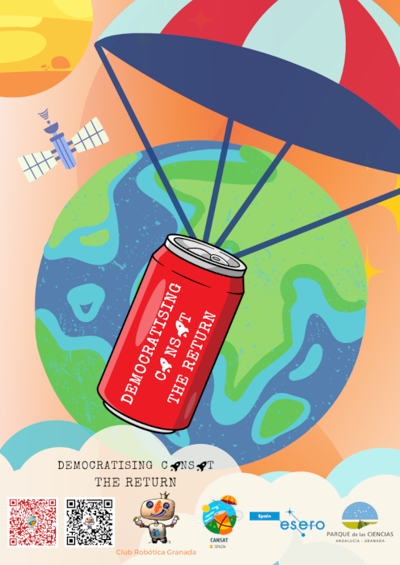

The original documentation has been developed by Pedro Ruiz, being tested and put into practice by José Luis Bueno and several CANSAT teams with which the Granada Robotics Club collaborates.

==**This website is a translation and adaptation of the original by Federico Coca.**==

* Arduinoblocks: software on which the whole project is based, with improvements developed by Juanjo López.
* Corrections and extension of documentation on LoRa communications by Jose María Fernández.
* Calculation of hemispherical parachute design based on the information provided by Pepe Alcaide.
* Design of 3D structure of CANSAT transmitter by David Morales Arellano, member of the CANSAT team ‘VegaSteam’ of the IES Federico García Lorca de Churriana de la Vega (Granada).
* Design of the 3D structure of the CANSAT transmitter by Pablo Moraga.
* Poster ‘Democratizing CANSAT II’ by Pablo Moraga.

## **Poster ‘Democratizing CANSAT II’**

by: Pablo Moraga

[Poster Democratizing CANSAT II. The Return](../img/index/DemocratisingCANSAT_TheReturn.png)