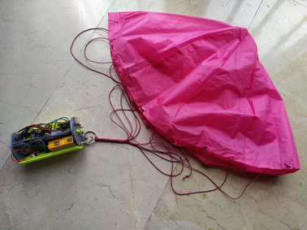

{align=right}

The parachute is hemispherical in shape. This shape was chosen because the calculation and development of the construction parts are simpler than other solutions. Moreover, the efficiency of the parachute has been demonstrated.
