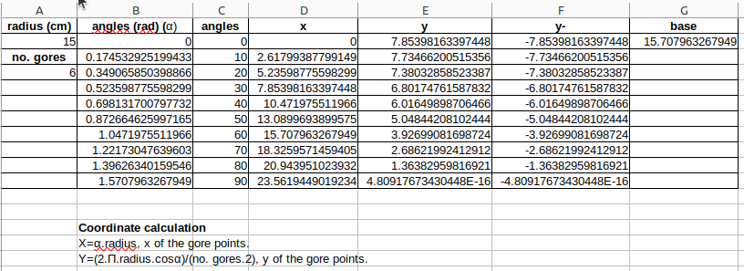
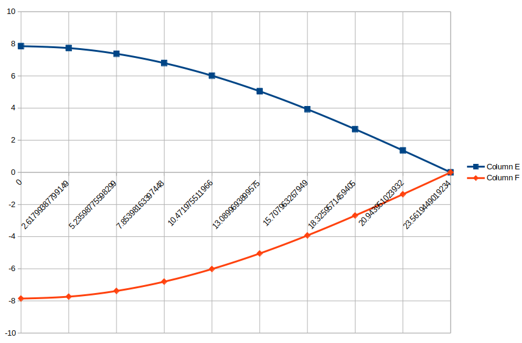
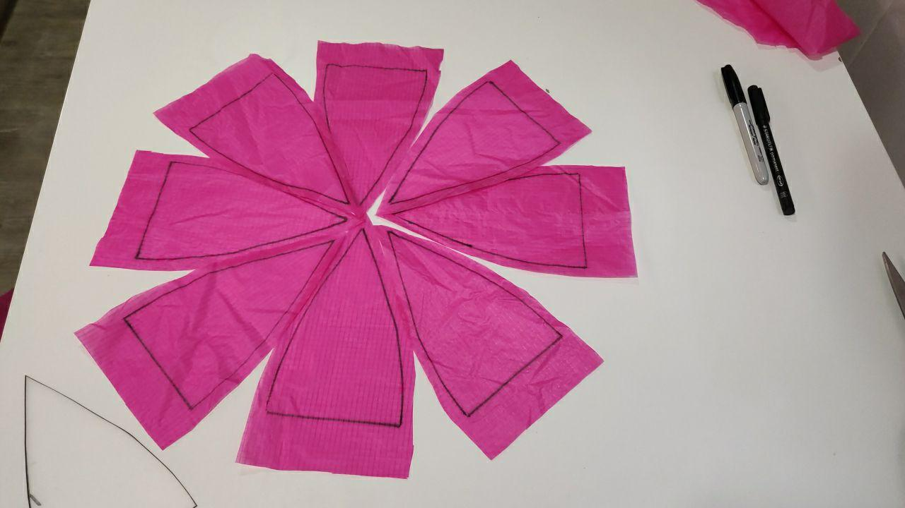

## **By spreadsheet**
A [spreadsheet](../spreadsheet/parachute_calculation.ods) has been created to calculate the shape and dimensions of the gores (sections or segments) of our parachute, depending on the radius chosen and the number of sections (gores).

The following mathematical expressions have been used to calculate the coordinates for the X and Y positions of the gores:

$x = \alpha (angle) \cdot radius$, x position of the gore points.

$y = \frac{2 \pi \cdot radius \cdot cos \alpha}{2 \cdot no. ~ of ~gores}$, y position of the gore points (there are two symmetrical positive and negative positions).

Example with parachute radius 15 cm and 6 gores:

Spreadsheet. Gore coordinates.

Spreadsheet. Representation of gore.

Image with 8 gores:

## **Spreadsheet**

* [parachute_calculation.ods](../spreadsheet/parachute_calculation.ods)

## **Via web**
This website [http://scottbryce.com/parachute/spherical_parachute.html](http://scottbryce.com/parachute/spherical_parachute.html), by providing data, gives us a graphic file to print and cut out the gores on paper.