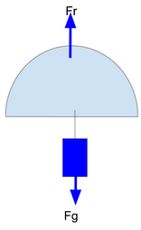

{align=right}

The aim of this section is to learn how to calculate the radius of the hemisphere that forms our parachute.

Calculation data: Mass between 300 and 350 g, recommended flight time maximum 120 s, descent speed between 6 and 12 m/s (recommended between 8 and 11 m/s).

To calculate, we will have to make the drag force of the parachute (Fr) equal to the weight that moves the parachute towards the ground (Fg=mg). When they are equal, the acceleration stops and the speed becomes constant, which is the rate of descent.

$\sum F = m \cdot a; F_r - F_g = m \cdot a (a=0; V = const)\rightarrow F_r = F_g$

Being $F_g = m_{cansat} \cdot g$ (weight of the cansat) and $F_r = \frac{1}{2} \cdot r \cdot C_d \cdot A \cdot V^2$ (drag force of the parachute) where:

* r = density of air (1.22 kg/m3)
* Cd = coefficient of aerodynamic drag in hemispherical parachutes, its value is 0.62
* A = surface of the parachute (in our case hemisphere)
* V = descent speed

I can clear the area of the parachute by equating the two expressions:

$m_{cansat} \cdot g =\frac{1}{2}\cdot r \cdot C_d \cdot A \cdot V^2 \rightarrow A = \frac{2 \cdot m_{cansat} \cdot g}{r \cdot C_d \cdot V^2}$

such as $A = 2 \cdot \pi \cdot R^2$ we can equal:

$2 \cdot \pi \cdot R^2 = \frac{2 \cdot m_{cansat} \cdot g}{r \cdot C_d \cdot V^2}$ and all that remains is to clear the parachute radius,

$R = \sqrt{\frac{2 \cdot m_{cansat} \cdot g}{2 \cdot \pi \cdot r \cdot C_d \cdot V^2}}$

To determine the fall speed and if the speed is constant (no acceleration), we have that $velocity = space / time$, the rocket reaches 1000 m in height (space to travel) and the time we said 120 s, therefore ...., we already have the V. We also have the mass of our cansat (from 300g to 350g), so we have everything to calculate our parachute radius or diameter.

## **Task: Calculate your parachute radius**
Calculate the radius or diameter with the real data of your cansat, remember that you have to know mass and fall speed.

??? Question "My solution"
    As starting data I will have a m=350g=0,35Kg, and a fall velocity of $velocity = \frac{space}{time}$ with a spacing (height) of 1000 m and a flight time of 120 seconds, we are left with $velocity = \frac{1000 m}{120 s} = 8.33 \frac{m}{s}$. Substituting the values into the radius equation we have:

    $R = \sqrt{\frac{2 \cdot m_{cansat} \cdot g}{2 \cdot \pi \cdot r \cdot C_d \cdot V^2}} = \sqrt{\frac{2 \times 0.35 kg \times 9.81 \frac{m}{s^2}}{2 \pi \times 1.22 \frac{kg}{m^2} \times 0.62 \times 8.33^2 \frac{m}{s^2}}} = 0.144 m = 144 mm$
