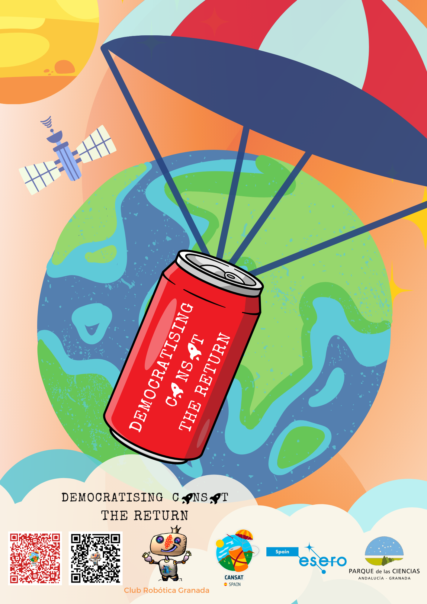

# Democratising CANSAT II. The Return
This project of Club Robótica Granada , tries to make the [CANSAT](https://esero.es/cansat-2/) project accessible to the greatest number of members of the educational community and/or enthusiasts.

The project is a continuation of the previous [Democratizando Cansat](https://clubroboticagranada.github.io/democratizandoCansat/index.html) (contents only in Spanish), and focuses on several aspects that facilitate the project such as:

* Easy connection of electronic components, as they can be connected directly to the board without the need for printed circuit boards, soldering, etc.
* Block-based programming, with compatibility with a large number of devices.
* Powerful and reliable communications based on LoRa, without the use of directional antennas.
* Control device with a large number of pins to connect devices and high processing capacity and connectivity.
* Data processing aids, parachute and satellite structure.

