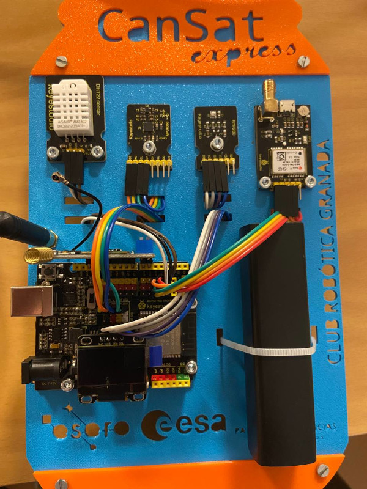
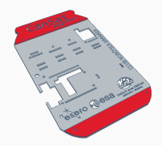
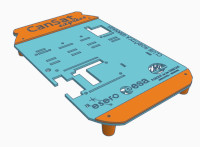
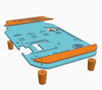

Cansat Express is a training product of the collaboration between ESERO Spain and Club Robótica Granada, with the aim of assembling and understanding the electronic system of democratising cansat II in a short time.

For this training, Pablo Moraga and Eufrasio Cabrera designed and built the following training panel, where the electronics of the Cansat transmitter are placed.

## **STLs Cansat Express**
In the links are available the Cansat Express stl files.

* [Base_CanSatExpress.stl](../STLs/express/Base_CanSatExpress.stl)
* [Cover_01_CanSatExpress.stl](../STLs/express/Cover_01_CanSatExpress.stl)
* [Cover_02_CanSatExpress.stl](../STLs/express/Cover_02_CanSatExpress.stl)
* [4xLeg_CanSatExpress.stl](../STLs/express/4xLeg_CanSatExpress.stl)
